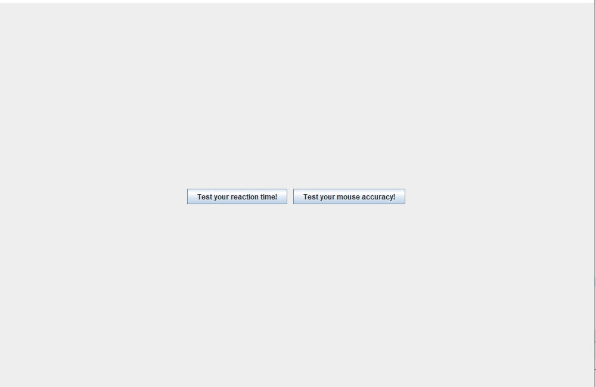
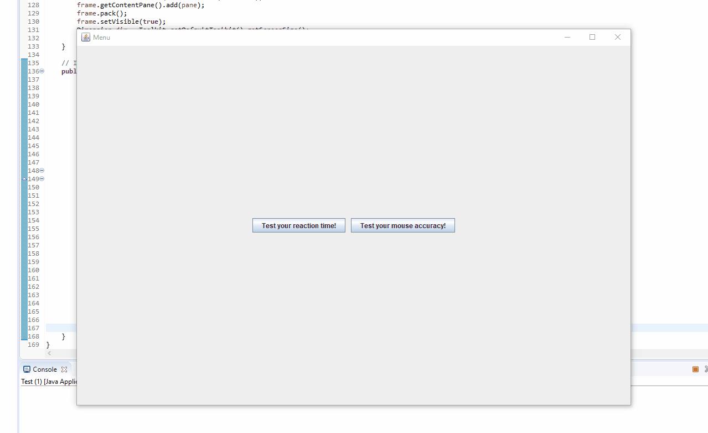

# Clicking
I created this application in an attempt to learn more about Java GUI applications using Java Swing. The Clicking application contains a main menu and two different clicking games that track reaction time or the user's mouse accuracy.

